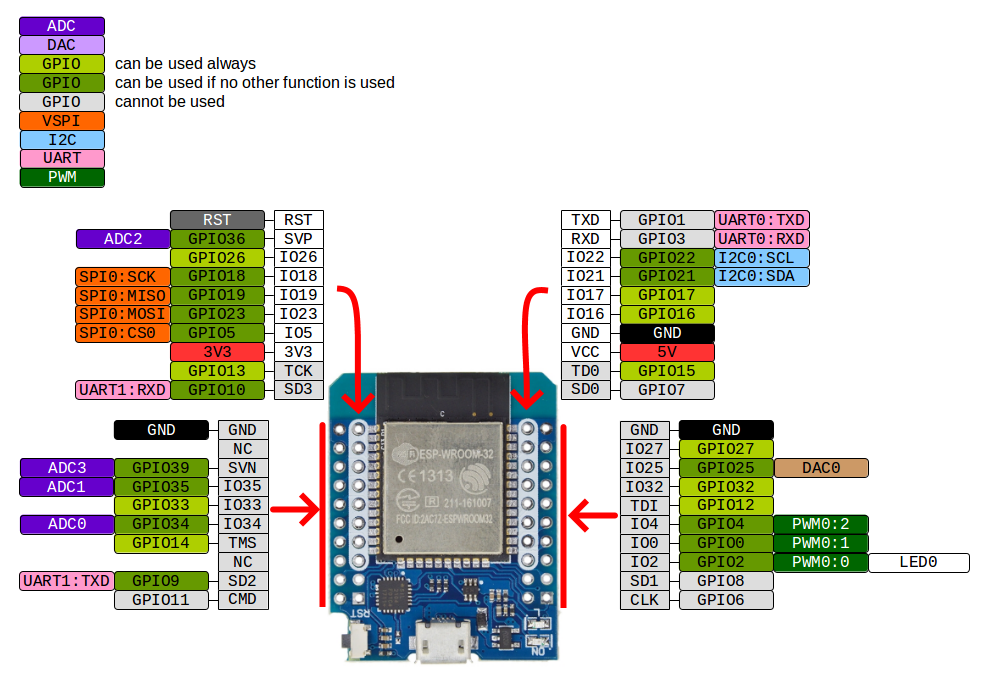
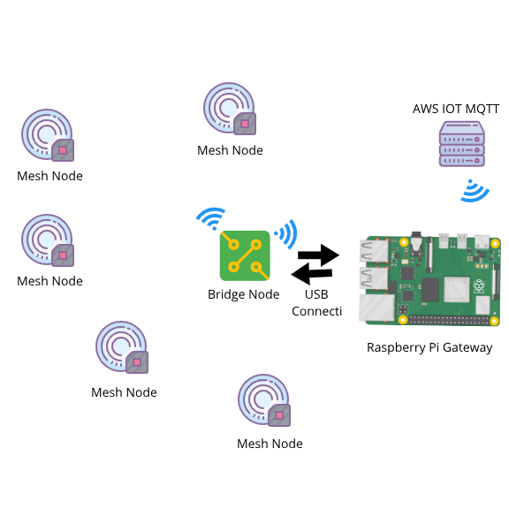

<p align="center">
  <a href="" rel="noopener">
 </a>
</p>

<h3 align="center">SensioMesh</h3>

<div align="center">

[]()


</div>

---


<p align="center"> SensioMesh
    <br> 
</p>

## 📝 Table of Contents

- [About](#about)
- [Getting Started](#getting_started)
- [Installing](#installing)
- [Circuit Diagram](#circuit)
- [Mesh Architecture](#circuit)
- [Usage](#usage)
- [Built Using](#built_using)
- [Authors](#authors)


## 🧐 About <a name = "about"></a>

This repo contains firmware and configuration instructions for SensioMesh Projects.

## 🏁 Getting Started <a name = "getting_started"></a>

These instructions will get you a copy of the project up and running on your local machine for development and testing purposes. See [deployment](#deployment) for notes on how to deploy the project on a live system.

### Prerequisites

What things you need to install the software and how to install them.

```
- Platform.io configured and running.
- Raspberry Pi with Raspberry Pi OS installed.
```

### Installing <a name = "installing"></a>

A step by step series that tell you how to get the Firmware and Backend running

#### One-click Installation

```diff
! Work in progress
```

#### Platform.io Configs

You should have Platform.io installed with the following pre-reqs

  1.  ESP32 Board should be installed in Platform.io
    

#### Sensor Nodes

Everything is already configured for Sensor Nodes Firmware and can be uploaded to the respective nodes for testing.

  1.  On line number 114 of MN_SensorNode(main.cpp) there is a function named `receivedCallback`. Whenever a data is being received by the Python script from MQTT, it is send to the Bridge Node and the Bridge Node broadcasts it to all the nodes in the mesh network. `receivedCallback` function is where the data is being received and msgRec is the final String varible which stores the received message which can be parsed and used for functionalities like node reset etc.
  2.  `sendMessage` on line number 90 of MN_SensorNode(main.cpp) is the function which is being called after every 1 second and broadcasts the node data to all the nodes in the network. Line number 95 contains a variable named msg which can be appended with any type of data like load sensors or temperature sensors in your case.
      1.  The final format of broadcasted message is in this format
        ```ESP32MAC Address;MeshNode ID;Any String Data ```

#### Bridge Node

Everything is already configured for the Bridge Node Firmware as well and can be uploaded to the respective node for testing.
 
  1.  On line number 91 of MN_BridgeNode there is a function `sendMessage`, which:
      1.  Sends the received data to the Raspberry Pi after every 0.5 seconds
      2.  Checks if there is an incomming data from the Raspberry Pi then:
          1.  Parses it
          2.  Broadcasts it to all the nodes in the mesh network
          3.  Sends ack message back to the Raspberry Pi
  2.  On line number 110 there is a function named `receivedCallback` which receives the data from all the nodes in the netowrk, parses it and then stores it in a custom-built data structure named `NodesHandler` which is in `nodesHandler.h` file.
  3.  Don't remove any Serial.print statement from Bridge Node firmware as it is used to communicate with the Raspberry Pi over USB Serial connection.

#### Gateway Node(Raspberry Pi)

To make the firmware ready for the Raspberry Pi

1.  Open the terminal and execute the following commands
    1.  sudo apt update
    2.  sudo apt upgrade
    3.  sudo pip3 install AWSIoTPythonSDK
    4.  sudo pip3 install --user pyserial
2. Then put the certificate files in certs folder and do the required changes in `mqttConfigs.py` file.
    1.  Copy PythonFirmware folder to your Raspberry Pis Desktop and run it using the following command
        ```python3 /Desktop/PythonFirmware/pyFirmware.py ```

##### Details

1.  The function named `broadcastDataToMesh` on line number 42 of `pyFirmware.py` file can be called anywhere to broadcast data to all the nodes in the network. For demo it is being called after every 30 seconds with temp data.
    1.  Always call the `broadcastDataToMesh` function in this format ```B:your Data```. 
2.  Line number 58 checks whether there's any incomming data and it contains any node information, if yes, it parses it within its block and publishes it to the MQTT broker.
3.  While line number 75 listens to the Acknowledgement messages from the Bridge Node.

## Circuit <a name = "circuit"></a>

```diff
! Work in progress
```

### ESP32 Dev Module Pinout


Follow the pinout diagram given below to connect different components to your TTGO LORA32 board.




### Circuit Diagram for Smart Joystick

Here's the complete circuit diagram of the system.


### Components Connections

```http
Other components pin connection details
```

#### Limit Switch

```Limit Switch Connection with ESP32```

| Limit Switch Pins | ESP32 | 
| :--- | :--- | 
| `PIN1(C)` | `18` |
| `PIN2(NO)` | `GND` |


#### ENS160

```ENS160 Connection with ESP32```

| ENS160 Pins | ESP32 | 
| :--- | :--- | 
| `SCL` | `GPIO22` |
| `SDA` | `GPIO21` |
| `GND` | `GND` |
| `VIN` | `3V3` |


#### BME280

```BME280 Connection with ESP32```

| BME280 Pins | ESP32 | 
| :--- | :--- | 
| `SCL` | `GPIO22` |
| `SDA` | `GPIO21` |
| `GND` | `GND` |
| `VIN` | `3V3` |


#### Mini PIR

```Mini PIR Connection with ESP32```

| Mini PIR Pins | ESP32 | 
| :--- | :--- | 
| `+` | `3v3` |
| `GND` | `GND` |
| `DO` | `GPIO39` |


#### LDR

```LDR Connection with ESP32```

| LDR Pins | ESP32 | 
| :--- | :--- | 
| `+` | `3v3` |
| `GND` | `GND` |
| `DO` | `GPIO34` |


#### INMP441

```INMP441 Connection with ESP32```

| LDR Pins | ESP32 | 
| :--- | :--- | 
| `VDD` | `3v3` |
| `GND` | `GND` |
| `L/R` | `GPIO25` |
| `WS` | `GPIO25` |
| `SCK` | `GPIO32` |
| `SD` | `GPIO33` |


## 🔧 Mesh Architecture <a name = "circuit"></a>

High level architecture of the Mesh network



## 🎈 Usage <a name="usage"></a>

1.  Open mqttConfigs.py file
2.  Put your MQTT broker details there before running the firmware.
3.  Connect Bridge Node to any USB port of the Raspberry Pi and then run the Firmware.
4.  There could be unlimited number of sensor nodes in the mesh network.

## Web App <a name="webapp"></a>
```diff
+ For future use
```
[Dashboard Link: ]()

You can access the webapp with following test acccount credentials

*   Email Address: `test@test.com`
*   Password: `test`

### Dashboard Screenshots

```diff
+ For future use
```

## Smartphone App <a name="smartphoneapp"></a>
```diff
+ For future use
```
[Smartphone App Link: ]()

## List of Components <a name = "list"></a>
```diff
+ For future use; not a comprehensive list
```
Following components are used to make this project

1.  [ESP32 WeMos D1 Mini](https://www.amazon.com/QCCAN-NodeMCU-Bluetooth-Development-Compatible/dp/B0B7191CZS/ref=sr_1_3?crid=YWCE44LHKGGI&dib=eyJ2IjoiMSJ9.GInKSNOBmZ4RaAZ3BpRQ3FSvnYirh-WmAEqGsBEOzScgjY_6cY-1DUx9Dwt6XK_paTPI78Mn-lKXODhAfZ04X7sr__bbzP2a6DxnPxkG3vjgZXxQQ3WqsQP035nYe1VA8hbCIHsbs8As7B887rKxjEfqbtkmkiu1kEu0UekLxL_fsR5oipP9NdJzl1xBY3VmXqB49cwWGuEXR3KxTRJ64swNU3z8KziyhUeb1b0vau8.T8j1mmA9PjYTXAVy1-y0CB5qGdh1BLdLOholgJJElSk&dib_tag=se&keywords=esp32+wemos+d1+mini&qid=1713120389&sprefix=esp32+wem%2Caps%2C155&sr=8-3)
2.  [ENS160+AHT21](https://www.amazon.com/DKARDU-Temperature-Humidity-Dioxide-High-Precision/dp/B0C6KBBGZS/ref=sr_1_2?crid=389HQWVMJTDTB&dib=eyJ2IjoiMSJ9.RGTFqzfVRI-j3KMVJo09qh7r_d65lH4twC5A5JKv00Fb9h4ekPNNvCfnEUf5x3ZdmA6POw5eTua5xqZSjMKnJm82S9HapuTJ4gMAt-JR2DyRQ9ueDvJltux9Eytz7uilpXriSZ80-_ovFKrUYFIJVVaFx9B4fvYXdCNgXrzSuo27hwBHYeXYhxmgVs4IvylURTVNUw0S8vvHnj4ZaKhTQtnFaZPFmfTasGrFQF1W0bnTVGEE-8p22JOQT1y0PiaG.uwepaFXB9yu_vf-KDdWsbiAbEnH0xu7BYZA8mAjqUhI&dib_tag=se&keywords=ens160&qid=1713120467&sprefix=ens160%2Caps%2C219&sr=8-2&th=1)
3.  [Micro Limit Switch](https://www.amazon.com/MXRS-Hinge-Momentary-Button-Switch/dp/B088W8WMTB/ref=sr_1_4?crid=3CN0BHI2VSEYB&dib=eyJ2IjoiMSJ9.T0nwOCO1grlhg8m2qc53JTOLWP6M03KwmrTz3doFkVQvfN2uRlY6brkoC6otQuedB_XGUdbXlr2oLe5OYT1tTW-_4-z9NeOzsQiAz3ymmvU46rvuSCng7SIuZpgXGkGrohiqBMI8rTtvgtlfR9UC9PZNL0YemEX1ge2m89_WLaXR68mf0nHuaIFFdic3sottLYVx7qW2vhdftPYprRFTJ3c60DPwEBoB7vTQ3RK-C7A.8w9uNWPUIvXE_bjvAz_mFUs_tlJpTYsIEY75DMPx14U&dib_tag=se&keywords=mini+limit+switch&qid=1713120501&sprefix=mini+limit+swithc%2Caps%2C164&sr=8-4)
4.  [BME 280](https://www.amazon.com/KeeYees-Temperature-Humidity-Atmospheric-Barometric/dp/B07KYJNFMD/ref=sr_1_6?crid=2VX87REKQOHT3&dib=eyJ2IjoiMSJ9.53nzlTsrwAxeYNYuWDCYX_1qft0ZuFcTbos7lbP90cUqZZi8DtpgnMpRxbAbNTQocgB1o1TiJkS7Qf6gkJBAEA_7lCl-rbwEGBl6hWkBjBiGZGRkgjdTxy3fAhCQDJjM5tWKjCl5KLMmwsqkYZVlPnKRpryqUr2G_yiE6rfJLXnVY0u6exmcDdHzkpaUydjNmyKYwbAbuqETyG0EwpITaEz9B0DeDVEs7hZLdrAekEM.c_SP1tW8cLcaJ9vaF0QyOjRVnpe4SUkOf6skAAhcVPs&dib_tag=se&keywords=bme280&qid=1713120769&sprefix=bme280%2Caps%2C231&sr=8-6)
5.  [Mini PIR Sensor](https://www.amazon.com/Stemedu-HC-SR505-Pyroelectric-Infrared-Detector/dp/B096NVJ439/ref=sr_1_6?crid=14Z4T9UN9YGLG&dib=eyJ2IjoiMSJ9.ul5yKvRKVDKbbe9o11gJrRDRVmMjqUbTUmvA9yIwxWMmR0wsPVAXDInKhFDlrdJ4P-8Hbw1WGjGehocnx0ev-GzRdjZT5VL8SlPHxJSrtjF2LlNO7a9_NuugfWdLM8ZZ_YQ0zyjitTI3vSyH05Qu6z2qdnP5Y961bFAIR5MP-Vj7bMlkWGKhJX62i7Hl4c0WlgsyhmqgMnTm9ZTEe33kKFy0ztHsrkusSpHgwIM37QETD45P53pcBB6Af6o4Vj99rIVLOkChzsjiuxCNcgXVLfysHLYcCXjBG3zqpfA2_Gc.1ukwccRUKnkbrbJg96Ifsj76mAvP6xlnlVMaXidBHNA&dib_tag=se&keywords=mini+pir&qid=1713120871&sprefix=mini+pir%2Caps%2C205&sr=8-6)
6.  [LDR Module](https://www.amazon.com/DIANN-Photosensitive-Dependent-Resistor-Detection/dp/B0BLSJ1CNP/ref=sr_1_2?crid=3CZADSMU97FY&dib=eyJ2IjoiMSJ9.YkAPooAGn7zn6JzQOR6TBxWMCzREKZ5iE9aA53CyNyzgzYOCluM_r5CsCREu6m-cSSA1nG6rfq1hPHkA3v4kPzf96uoDadjvqSYfffBaZXegLW3v9Ow_L0UeJUxKQdChB7GhsKRJ42c9nMkTGbZIfNPnqXtbQ6LyFiXlD0cIkxn5z8j5mSM7dik3Fse5ImGz9myGKFPQSx8eH0zrlCQyPQ9IUF4UjkY3lz7mZAFuTMY.atgH9Zb_5sif4I5h4HZTi2bBLOtdlQMOAbREjky6-bo&dib_tag=se&keywords=ldr+module&qid=1713121092&sprefix=ldr+modul%2Caps%2C216&sr=8-2)
7.  [INMP441](https://www.amazon.com/INMP441-Omnidirectional-Microphone-Interface-Precision/dp/B09BB1F4C8/ref=sr_1_6?crid=12EDWZCW2RS3E&dib=eyJ2IjoiMSJ9.-pTuopcMK8aUA7-QIjdVj6TojBC6EHMGlBec_TfSxp98c7xdDmns5070uhKfyOQBNUYkn0drSnaEylg97MlnwQbJ4uqaM5Ykb3R5BUny8Afh2HG9TNm-jfV_VibHBB7LmWZpgSczUGGG2zwRTgxsUVqh2Od3fD04TyYSiT4URdVHJghzVEkyEXxm-MuG0MqS_nyYbeH3SwZVkOSX2Ye_ajIgdxSaRbfdp__DJxMZrk-gdPqqV14iZOC25zg29o43TgZJg2ucPyrCbeA2EIxIo5bl2ogFrQ2uU5NUReZSH-Q.D7Q30vEA0B5FeytokKDQtwrsav-fwv8528_ENo07dT8&dib_tag=se&keywords=INMP441&qid=1713121823&sprefix=inmp441%2Caps%2C215&sr=8-6)
8.  [Micro USB Cable](https://www.amazon.com/Android-Charger-sweguard-Charging-Phone-Grey/dp/B09MT18H3J/ref=sr_1_2_sspa?keywords=micro+usb+cable&qid=1661962441&sprefix=micro+usb+%2Caps%2C181&sr=8-2-spons&psc=1&spLa=ZW5jcnlwdGVkUXVhbGlmaWVyPUEzVkw1N1RQVTVHTVA3JmVuY3J5cHRlZElkPUEwODYyODU0MUdBSDQwTjBWVDZVSiZlbmNyeXB0ZWRBZElkPUEwODMyNjQyMVo4WU1VOVQ5UlMzQiZ3aWRnZXROYW1lPXNwX2F0ZiZhY3Rpb249Y2xpY2tSZWRpcmVjdCZkb05vdExvZ0NsaWNrPXRydWU=)


## ⛏️ Built Using <a name = "built_using"></a>

- [Platform.io](https://platformio.org/) - Embedded Development Environment
- [PainlessMesh](https://gitlab.com/painlessMesh/painlessMesh/) - Mesh Development Framework
- [Python](https://www.python.org/) - Programming Language

## Demo Video

- [Sensor Node/Bridge Node Firmware](https://youtu.be/JaxaSnypMZQ)

## Test Performed
- List of tests performed from development perspective.
  - Hardware Assembly(INMP441, Limit Switch, ESP32, LDR, ENS160, BME280)
  - Sensor Node and Bridge Node Firmware test(two sensor nodes and one bridge node)

## ✍️ Authors <a name = "authors"></a>

- [@Nauman3S](https://github.com/Nauman3S) - Development and Deployment

