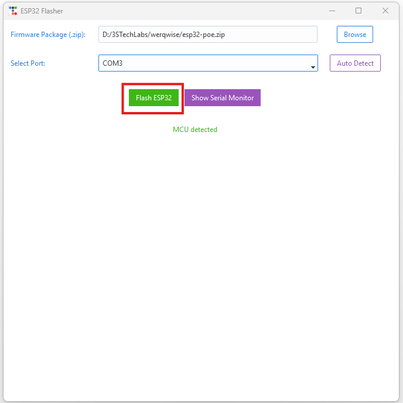
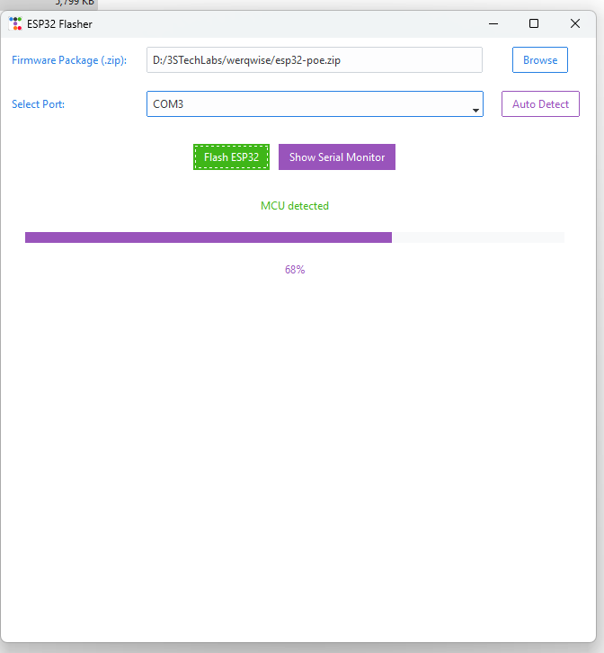
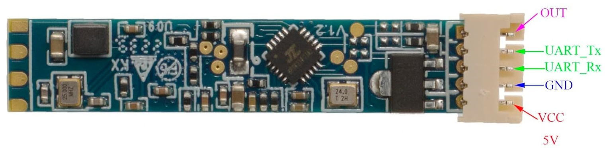
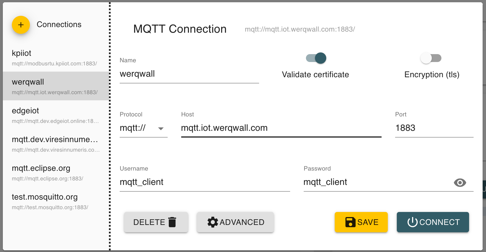
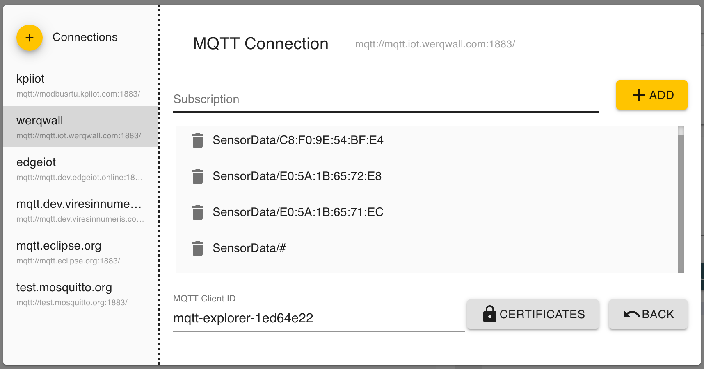
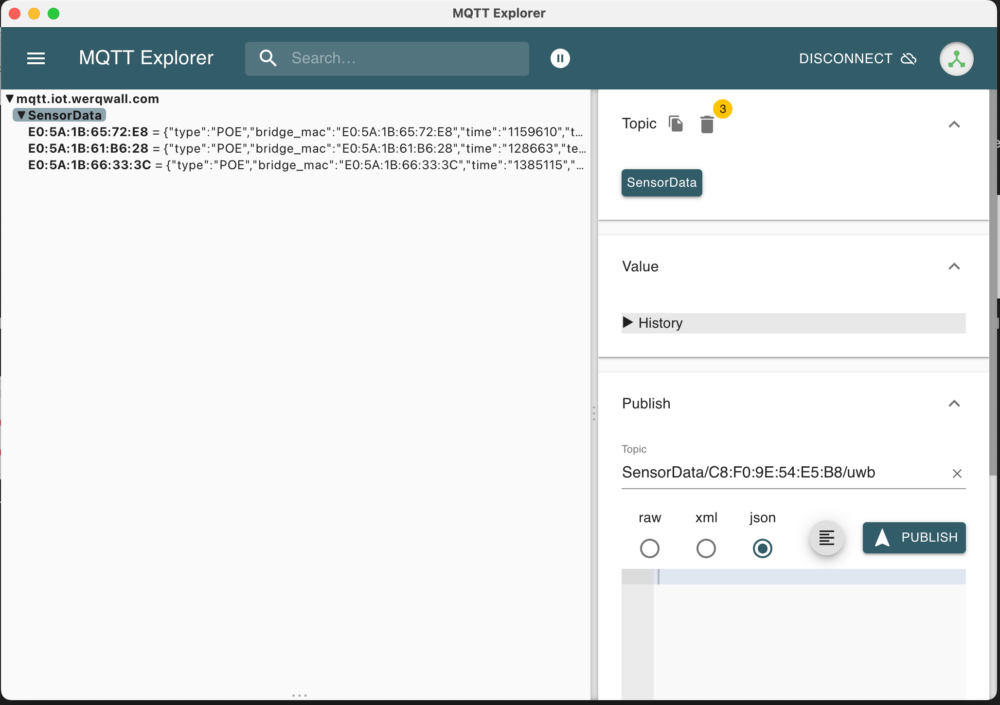
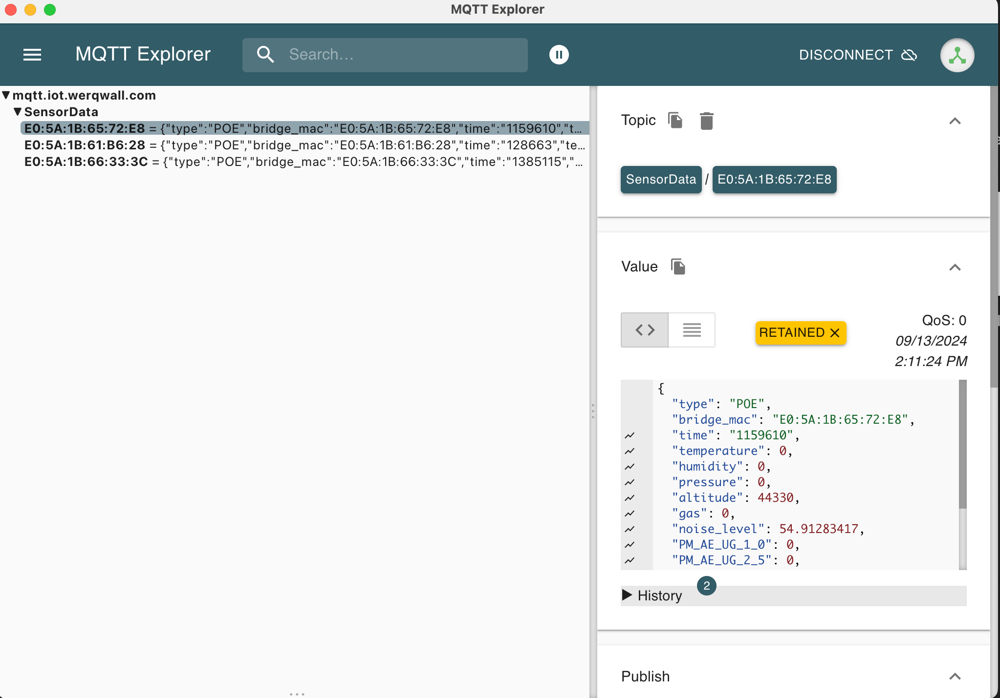

<p align="center">
  <a href="" rel="noopener">
 </a>
</p>

<h3 align="center">SensioMesh</h3>

<div align="center">

[]()


</div>

---


<p align="center"> SensioMesh
    <br> 
</p>

## 📝 Table of Contents

- [About](#about)
- [Getting Started](#getting_started)
- [Installing](#installing)
- [Circuit Diagram](#circuit)
- [Mesh Architecture](#circuit)
- [Usage](#usage)
- [Built Using](#built_using)
- [Authors](#authors)


## 🧐 About <a name = "about"></a>

This repo contains firmware and configuration instructions for SensioMesh Projects.

## 🏁 Getting Started <a name = "getting_started"></a>

These instructions will get you a copy of the project up and running on your local machine for development and testing purposes. 

### Prerequisites

What things you need to install the software and how to install them.

```
- Platform.io configured and running.
```

```diff
- YOU SHOULD NOT CONNECT ESP32-POE to computer’s USB port while it is powered by Ethernet POE!!! If you connect USB while ESP32-POE is powered by Ethernet you will damage the board or your computer or both.
```
### Installing <a name = "installing"></a>

A step by step series that tell you how to get the Firmware and Backend running

#### One-click Installation

## Driver Installation
1. Connect the ESP32 to the Computer USB Port.
2. In Windows Search, search Device Manager and open it. Scroll down to Ports.

 - If the drivers are not installed you will see the CP2102 USB to UART Bridge Controller.
 - If the Drivers are Installed You will See the Following in the Ports.                                                      
 
 - Here the Port is COM7 for the ESP32.
1. To Install the Drivers Right Click on the `CP2102 USB to UART Bridge Controller` and then click on the `Update Driver / Install Driver`.
2. Click on `Browse my Computer from Drivers` for Drivers Installation.                                                                   

1. Select the `CP2102x_VCP_Windows` folder in the ESP32_Flasher folder to which the esp32_flasher.zip is extracted.

1. Click on `Next` and the drivers will be installed in some time. On Successful Installtion you will see the following message.


#### Uploading Firmware to ESP32
1. Connect ESP32 to Computer USB Port.
2. Get the [ESP_Flasher](https://github.com/3STechLabs-org/ESP32-Flasher/releases/)
3. Double Click on `ESP_Flasher.exe` or the `ESP_Flasher` for MacOS.
4. You will see the following Window.                                      

 - If ESP32 is connected you will see the MCU Connected Message.
1. In Windows Search, search Device Manager and open it. Scroll down to Ports.
 - Here you see the `Silicon Labs CP210x USB to UART Bridge (COM3)`, it means ESP32 is connected to `COM3`.


1. Now Select the Port on which ESP32 is Connected from the Drop Down Menu.                                                

1. Now in the ESP_Flasher tool Click on the `Browse Button` in front of Select Firmware (.zip).                                                 

 - This will open a window for Selecting the `.zip` file of the firmware.

1. Open `release` folder.
 - Here you will find files with `.zip` extension. 
 - Select this file and Click on Open.                                                                             
 
1. You will now see the path of the `.zip` file in the text field.                 

1.   Now Click on the `Flash ESP32` Button.                                
      
1.   It will start flashing the MCU and you will start seeing the progress bar.                                               
 
1. Once the firmware is flashed you will see this screen with `100% Progress Bar`, `Mac Address`, and `Serial Monitor`.                                             


#### Sensor Nodes

Everything is already configured for Sensor Nodes Firmware and can be uploaded to the respective nodes for testing.


## Circuit <a name = "circuit"></a>


## Schematics


### ESP32 POE Module Pinout


Follow the pinout diagram given below to connect different components to your ESP32-POE.


### Components Connections

```http
Other components pin connection details
```

#### Limit Switch

```Limit Switch Connection with ESP32```

| Limit Switch Pins | ESP32 | 
| :--- | :--- | 
| `PIN1(C)` | `34` |
| `PIN2(NO)` | `GND` |

#### SCD40 - CO2 Sensor

```SCD40 Connection with ESP32```

| SCD40 Pins | ESP32 | 
| :--- | :--- | 
| `SCL` | `GPIO16` |
| `SDA` | `GPIO13` |
| `GND` | `GND` |
| `VDD` | `3V3` |


#### BME680

```BME680 Connection with ESP32```

| BME680 Pins | ESP32 | 
| :--- | :--- | 
| `SCL` | `GPIO16` |
| `SDA` | `GPIO13` |
| `GND` | `GND` |
| `VCC` | `3V3` |


#### Mini PIR

```Mini PIR Connection with ESP32```

| Mini PIR Pins | ESP32 | 
| :--- | :--- | 
| `+` | `3v3` |
| `GND` | `GND` |
| `DO` | `GPIO03` |

#### Microwave Radar - Human Presence Sensor

```Microwave Radat Connection with ESP32```

| Microwave Radar Pins | ESP32 | 
| :--- | :--- | 
| `RX` | `GPIO4` |
| `TX` | `GPIO5` |
| `GND` | `GND` |
| `VCC` | `5V` |



#### LDR

```LDR Connection with ESP32```

| LDR Pins | ESP32 | 
| :--- | :--- | 
| `VCC` | `3v3` |
| `GND` | `GND` |
| `AO` | `GPIO36` |


#### INMP441

```INMP441 Connection with ESP32```

| LDR Pins | ESP32 | 
| :--- | :--- | 
| `VDD` | `3v3` |
| `GND` | `GND` |
| `L/R` | `GPIO14` |
| `WS` | `GPIO14` |
| `SCK` | `GPIO32` |
| `SD` | `GPIO33` |

#### PMS5003 - Digital Particle Concentration Laser Sensor

```PMS5003 Connection with ESP32```

| PMS5003 Pins | ESP32 | 
| :--- | :--- | 
| `TX` | `GPIO39` |
| `RX` | `GPIO15` |
| `GND` | `GND` |
| `VCC` | `5V` |


## 🔧 Mesh Architecture <a name = "circuit"></a>

High level architecture of the Mesh network


## Web App <a name="webapp"></a>

[Dashboard Link: https://app.iot.werqwall.com/](https://app.iot.werqwall.com/)

More details can be found in [Frontend repository](https://github.com/werqwise/Frontend/tree/main#werqwise-frontend).


## Smartphone App <a name="smartphoneapp"></a>
```diff
+ For future use
```
[Smartphone App Link: ]()

## Testing and Debugging the Nodes

In order to test or debug the potential issues or to discover the devices we can use MQTT Explorer.

1. Get the [latest version of MQTT Explorer](https://github.com/thomasnordquist/MQTT-Explorer/releases/latest)
2. Open the MQTT Explorer and add a new connection with the following details:

3. Go to `Advanced` settings and in `Subscriptions` box put `SensorData/#`:

4. Click on `+ ADD` button to add it. You can skip the other `Subscription Topics` as we don't need them.
**Do not modify the `MQTT Client ID`**
5. Click on `Back` button.
6. Click on `Save` and then `Connect`

7. In the next screen, you will see all available and online devices. It auto discovers the devices as soon as they get internet connection.

8. Whenever a new data packet comes, they MAC address of the respective device will blink. You can also click on little bin icon next to `Topic` on right-hand side to delete any older/retained data but it is not necessary.
9. You can click on any MAC address to see the incoming data details and sensor values.

10. To check if UWB is working, you will see a little dropdown button before the MAC address of the device which has a UWB module available. On clicking that, you will see UWB related data.


## List of Components <a name = "list"></a>
```diff
+ For future use; not a comprehensive list
```
Following components are used to make this project

1.  [ESP32 POE - Microcontroller](https://www.digikey.com/en/products/detail/olimex-ltd/ESP32-POE/10258717?s=N4IgTCBcDaIIxwByILQFEDKAFAzGFWA8migHIAiIAugL5A)
2.  [Connector](https://www.digikey.com/en/products/detail/assmann-wsw-components/H3DDS-1006G/1218627?s=N4IgTCBcDaIBIGYAiSDKBaAjABmwNgHEQBdAXyA)
3.  [POE Power Injector(Only required for non-POE networks)](https://www.amazon.com/TP-LINK-TL-PoE150S-Injector-Adapter-Compliant/dp/B001PS9E5I/ref=sr_1_4?crid=1DB5LSHG7F02Y&dib=eyJ2IjoiMSJ9.4aUI7A0-JLVkgRzhlkvI6JF4Wyu5R6RjjT2Q6QR_wIlJx-f3g0z-tBvhbTqTBGvcCqFE-P27d4JbP_8tmqa1y2jucQEh-8cNlHetQEV1enwxEfmW7lrHDpYrdOvKL2h1m7lwSFW7qmDzAwnrcVa5iu1GEXfyiBZjCezwijgr1-IyjyPByxjuWQmpfrnHr11CSPTnvZTN43HTm-h4x9LjeMPhO6e8K-V1OwKdb8puYE0.Sa63Xr9FCesweZSf28gKM6zGndgGA-tHQhGSkb8mVGQ&dib_tag=se&keywords=poe+power+injector+tplink&qid=1718901729&sprefix=poe+power+injector+tplink%2Caps%2C244&sr=8-4)
4.  [Multiport POE Switch(TP-Link TL-SG1005P){Optional}](https://www.amazon.com/TP-Link-Compliant-Shielded-Optimization-TL-SG1005P/dp/B076HZFY3F/ref=sr_1_14?crid=1HFV6T97UF5PQ&dib=eyJ2IjoiMSJ9.Seo94exTHzamg_BR2CZHZcAM4lfAtZFWNl_NCp2wLXkGQH8QGIABlmAw__zO9S9zQUzYS8qY_ZxoqCdA-6Q2XL_NkqwqqdivcPa78pqtle8XpCAzTl0aXyCfMPuCrrEgKW4bdyEXffRIPwXh5z7ZPtKrgiwIRvkspPgYkmiDmivQKlr6MtKhwc2p2ikv5NaA-LUxlRw4q_Lt_k19KI1_8PuCKY8JiBIAoGUmKxza4B4.ithMWskx622GLAnvhPtSt1mTN8ibSdmYWlsoqgKG2w0&dib_tag=se&keywords=poe%2Binjector&qid=1723456590&sprefix=poe%2Bin%2Caps%2C167&sr=8-14&th=1)
5.  [Micro Limit Switch](https://www.amazon.com/MXRS-Hinge-Momentary-Button-Switch/dp/B088W8WMTB/ref=sr_1_4?crid=3CN0BHI2VSEYB&dib=eyJ2IjoiMSJ9.T0nwOCO1grlhg8m2qc53JTOLWP6M03KwmrTz3doFkVQvfN2uRlY6brkoC6otQuedB_XGUdbXlr2oLe5OYT1tTW-_4-z9NeOzsQiAz3ymmvU46rvuSCng7SIuZpgXGkGrohiqBMI8rTtvgtlfR9UC9PZNL0YemEX1ge2m89_WLaXR68mf0nHuaIFFdic3sottLYVx7qW2vhdftPYprRFTJ3c60DPwEBoB7vTQ3RK-C7A.8w9uNWPUIvXE_bjvAz_mFUs_tlJpTYsIEY75DMPx14U&dib_tag=se&keywords=mini+limit+switch&qid=1713120501&sprefix=mini+limit+swithc%2Caps%2C164&sr=8-4)
6.  Indoor Environment Monitoring
    1.  [BME 680 -  Temperature, Pressure, Humidity and VOC Sensor](https://www.amazon.com/ACEIRMC-Temperature-Humidity-Compatible-Raspberry/dp/B0BR9TXW43/ref=sr_1_2?crid=25BKEV9CMHJGX&dib=eyJ2IjoiMSJ9.pb0nogRNQM2bJvxajNwxWXZL1hm-bmwsi7dIAm8Z2uwSiIOEGeL8bdKSCrw40WCye6FzGV0mmhCfsBIIdjeeQiY9L8bfC0kgAWw_bMytkiRBKdpzaLkPPd7jZJaBSWjX4_Wg9_-hWFCFC1L1RfS8fOPUcGZdKirmpFdQMN3lsOFrK9s2lGdOBkoSAsYMq7AFJrvmatQDkIn9F3l6xxBCmneQuBt2oYCY4_PPseQpvpo.9-E741UJik11i9Wjj58Lf-DYporPCffDuuoVvWCzQW8&dib_tag=se&keywords=bme680&qid=1722367138&sprefix=bme680%2Caps%2C239&sr=8-2&th=1)
    2.  [PM2.5 Sensor - Particulate Matter](https://www.amazon.com/DEVMO-Digital-Particle-Concentration-PMS5003/dp/B07S5YX84W/ref=sr_1_3?crid=15L48F4HRYXXP&dib=eyJ2IjoiMSJ9.wkiZzPdRAZfcwnBvUiZ0HMhqy3oMzBeQejoYPm4wp2qMqM6zli-7qCDSLez2JUjjmxaFYS5pCUMfCLHXM48s1ZEQQyzpBQCZn2gwcwuGOEqxzVSI_mnnOkhZ_VS6YFJCMd2tWtx6P9zCQwQzV-CyXBpZYxc4-fQcWInyoMrGUo7j5b6y3381p79MfM2qYEW7h0SJEOih3vAnsclBaMNkeZbBZyK36sT6XHvMLjk3JdY.7VjWKU1rh7UP_Qd6XOwefDoW9qKi6iw1rt3EaE-ZUGI&dib_tag=se&keywords=pm2.5%2Bsensor&qid=1722366550&sprefix=pm2.5%2Caps%2C692&sr=8-3&th=1)
    3.  [SCD40 - CO2 Sensor](https://www.amazon.com/Rakstore-detects-Temperature-Humidity-Communication/dp/B09Y1HRLGT/ref=sr_1_6?crid=2XB2B78MQK0UF&dib=eyJ2IjoiMSJ9.2O3Z7O95yVrshmSWMqhbihA-i4veGPhCdDYVUUQVW6t_mYuj10QTB4lP2H4lscvIlq3TJH8U4-GEpsJ_o8mNWA3_jUbr1GwrXpfZ6ENwG7OmwnBerHRTsN24j9K1j-zE7BCbkQ-SWxqk6wHjdciacw.Xc7KK6Ok7afmv7TWfRJYDv3SK9V6AO72KKspvR2HjCc&dib_tag=se&keywords=scd40&qid=1722368146&sprefix=scd40%2Caps%2C321&sr=8-6)
7.  Human Presence Sensor
    1.  [Microwave Presence Sensor](https://www.amazon.com/Microwave-Radar-Sensor-Module-LD2410-24GHz-ISM-Band-Human-Presence-Motion-Sensing-Module-Non-Contact-Monitoring-Detector-Support-GPIO/dp/B0BJ8CWWS9/ref=sr_1_19_mod_primary_new?dib=eyJ2IjoiMSJ9.MexP-lj4JVRT4S6T4QbUYkwooECUMYNGAEX3nVJGKcea1IjrT4hp4oDNKxeGPH2kuyxhm0R4ZsISKUSznpnziODZ0wOgPwzKVGMSc5Mdi_4dLgLep-DbcdFWepDQ4uBUJ8lUL6fB1vCGObHl6iKGuM7BYPuJy7hYxt8-wkNErPSKWwSDIjgXpfafv0szrdC2rtV5BAbUJQ-QDYJ88Xrxd6sGLwosPWkg6OVyOsM0tjo.V5Tu-cx-khinvGxlSY-FIQjf_2T5kw5Cc4mLDvuxO-U&dib_tag=se&keywords=LD2410&qid=1722365342&sbo=RZvfv%2F%2FHxDF%2BO5021pAnSA%3D%3D&sr=8-19)
    2.  [PIR Sensor (6M Range)](https://www.amazon.com/HC-SR501-Sensor-Infrared-Arduino-Raspberry/dp/B07KBWVJMP/ref=sr_1_10?crid=3OQ9BENYSZGUQ&dib=eyJ2IjoiMSJ9.b5ROBRhqrPmMlmQQjsHw_8cwe5GAL-p-UVhjSJPvZwA4RFxthg_KDPQwJRMh37yyXnHG3R2EPamV8Z2Ea0x3SJgDbAvgbZgYehsRmsD-LljkIla8SXo2Ewpctq48BnCvf9JvDBdMEzgYHhQ4JOOkPb-WbC11fYA7ZkRCoaCmZ0-DAgyqjHm3vdkf4azaXHyZeW90Tv9BDk0TKyo9fTMtitqlkgxc7vnIADddYhz0aJg.coBQBFjmkZH1WAqoao8d-yTYn4Szr4MsQ98JDHFK3C4&dib_tag=se&keywords=pir+module&qid=1722366275&sprefix=pir+modu%2Caps%2C229&sr=8-10)
8.  LDR Module - Light Intensity Sensor
    1.  [LDR Module - Light Intensity Sensor](https://www.amazon.com/DIYables-Sensor-Arduino-ESP8266-Raspberry/dp/B0CF5443Q2/ref=sr_1_2?crid=3PM9HQXJ4B5KM&dib=eyJ2IjoiMSJ9.GpqpOD2RzMNtehkggc6UYVT8taXTiSlTL8mlFb5fDhaJplZyBdJnAtYON9NUSEZGqgisc0FcQH8BH3rfx1QVTTmBUmbdNkmXSkswcR8_XoOw363KQtz8XyhypwupZqx3SpsK7QCNM9poG13EnWkIvuzr6EUsrCcBqi4ORj6L01TexAe6yUViwm9421jnDhgPf5rZ2I1wLDWLawawLTyrn4PsFB9dPnUJma5lD5Xdh5s.43K5sLwOK1PAwGbcSx1hW4OW62yhxLvz2AiexP14nOY&dib_tag=se&keywords=ldr%2Bmodule&qid=1722365181&sprefix=ldr%2Bmodu%2Caps%2C407&sr=8-2&th=1)
    **OR**
    2. [LDR Module](https://www.amazon.fr/AZDelivery-Résistance-Capteur-Arduino-compris/dp/B07ZYXHF3C/ref=sr_1_6?dib=eyJ2IjoiMSJ9.qpo7TGXpI-OmTrnq727VgWP7w8hh0pqFNEiBRKOSQtiNQhxtzhTPTvDazSiZkQfhuy4gjJBkM970awCRYH35w9-VHFpSiNe0qH2l2tndQWXJLXlFMzKyVL-ZnxujY9jgjPWkmVBMfXZ1J6MFfdT3qKTgJrZEiNHKtSX2VXIjzu-h1spmZItmToWhjTN-k36-ltrHJbmOxxdwqdXMuTAEhnm2_NHGiBP4ja6SWWLSh2FSud-vY34IupyST2a1ZsyJxWzOBQi8DNo64gMafZ3wZ7_0EA5dglAmo8dod6NjDDA.l6m4LadaHxsUEsG-iewEZz4lKG4hKROUSlNOLNd77hc&dib_tag=se&keywords=ldr+module&qid=1721982295&)
9.  [INMP441 - Microphone](https://www.amazon.com/INMP441-Omnidirectional-Microphone-Interface-Precision/dp/B09BB1F4C8/ref=sr_1_6?crid=12EDWZCW2RS3E&dib=eyJ2IjoiMSJ9.-pTuopcMK8aUA7-QIjdVj6TojBC6EHMGlBec_TfSxp98c7xdDmns5070uhKfyOQBNUYkn0drSnaEylg97MlnwQbJ4uqaM5Ykb3R5BUny8Afh2HG9TNm-jfV_VibHBB7LmWZpgSczUGGG2zwRTgxsUVqh2Od3fD04TyYSiT4URdVHJghzVEkyEXxm-MuG0MqS_nyYbeH3SwZVkOSX2Ye_ajIgdxSaRbfdp__DJxMZrk-gdPqqV14iZOC25zg29o43TgZJg2ucPyrCbeA2EIxIo5bl2ogFrQ2uU5NUReZSH-Q.D7Q30vEA0B5FeytokKDQtwrsav-fwv8528_ENo07dT8&dib_tag=se&keywords=INMP441&qid=1713121823&sprefix=inmp441%2Caps%2C215&sr=8-6)
10. [Micro USB Cable](https://www.amazon.com/Android-Charger-sweguard-Charging-Phone-Grey/dp/B09MT18H3J/ref=sr_1_2_sspa?keywords=micro+usb+cable&qid=1661962441&sprefix=micro+usb+%2Caps%2C181&sr=8-2-spons&psc=1&spLa=ZW5jcnlwdGVkUXVhbGlmaWVyPUEzVkw1N1RQVTVHTVA3JmVuY3J5cHRlZElkPUEwODYyODU0MUdBSDQwTjBWVDZVSiZlbmNyeXB0ZWRBZElkPUEwODMyNjQyMVo4WU1VOVQ5UlMzQiZ3aWRnZXROYW1lPXNwX2F0ZiZhY3Rpb249Y2xpY2tSZWRpcmVjdCZkb05vdExvZ0NsaWNrPXRydWU=)

## ⛏️ Built Using <a name = "built_using"></a>

- [Platform.io](https://platformio.org/) - Embedded Development Environment
- [Python](https://www.python.org/) - Programming Language

## Demo Video

- [Sensor Node/Bridge Node Firmware](https://youtu.be/JaxaSnypMZQ)

## Test Performed
- List of tests performed from development perspective.
  - Hardware Assembly(INMP441, Limit Switch, ESP32, LDR, ENS160, BME280)
  - Sensor Node POE Firmware test


## JSON Parsing Guide
### JSON Structure
```json
{
    "type": "POE",
    "time": "612519",
    "temperature": 0,
    "humidity": 0,
    "pressure": 0,
    "altitude": 44330,
    "noise_level": -92.65919495,
    "mq135_aqi": 60,
    "ldr": 4095,
    "limit_sw": 0,
    "pir": 0
}
```
### Detailed Explanation
1. `Type`: Type of the payload.
2. `altitude`: A string representing the altitude measurement.

 3. `humidity`: A string representing the humidity level.

 4. `ldr`: A string representing the Light Dependent Resistor (LDR) value, which measures light intensity.

 5. `limit_sw`: A string indicating the status of a limit switch.

 6. `mq135_aqi`: A string representing the air quality index measured by the MQ135 sensor.

 7. `noise_level`: A string representing the noise level.

 8. `pir`: A string indicating the status of a Passive Infrared (PIR) sensor, typically used for motion detection.

 9. `pressure`: A string representing the atmospheric pressure.

 10. `temperature`: A string representing the temperature.

 11. `time`: A string representing the timestamp of the data reading.


### Key Considerations for Web Development
1. `Error Handling`: Implement robust error handling for cases where sensor readings may be missing or malformed.


## ✍️ Authors <a name = "authors"></a>

- [@Nauman3S](https://github.com/Nauman3S) - Development and Deployment

