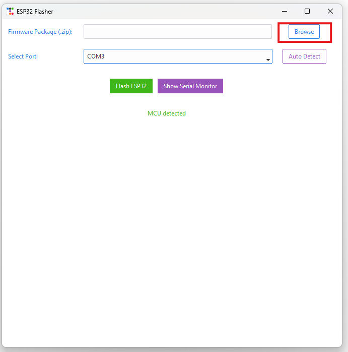
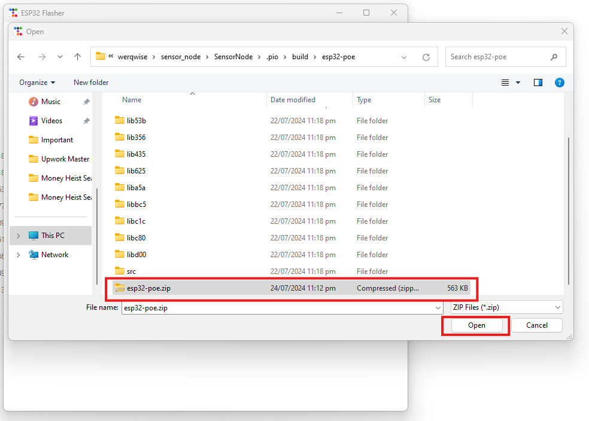
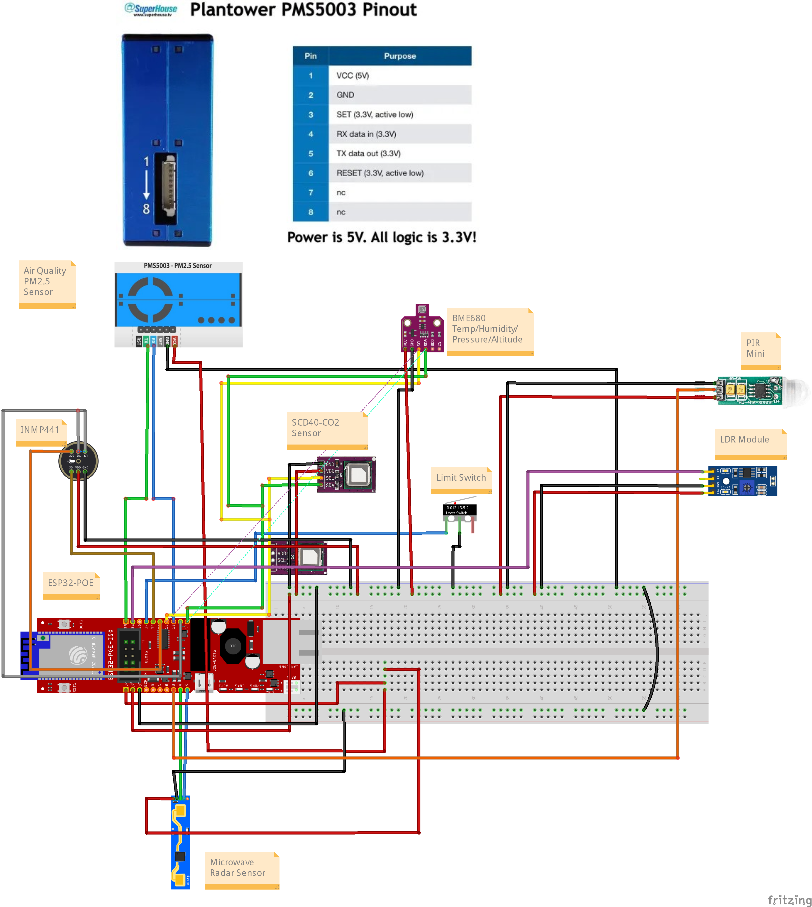

<p align="center">
  <a href="" rel="noopener">
 </a>
</p>

<h3 align="center">SensioMesh</h3>

<div align="center">

[]()


</div>

---


<p align="center"> SensioMesh
    <br> 
</p>

## 📝 Table of Contents

- [About](#about)
- [Getting Started](#getting_started)
- [Installing](#installing)
- [Circuit Diagram](#circuit)
- [Mesh Architecture](#circuit)
- [Usage](#usage)
- [Built Using](#built_using)
- [Authors](#authors)


## 🧐 About <a name = "about"></a>

This repo contains firmware and configuration instructions for SensioMesh Projects.

## 🏁 Getting Started <a name = "getting_started"></a>

These instructions will get you a copy of the project up and running on your local machine for development and testing purposes. 

### Prerequisites

What things you need to install the software and how to install them.

```
- Platform.io configured and running.
```

```diff
- YOU SHOULD NOT CONNECT ESP32-POE to computer’s USB port while it is powered by Ethernet POE!!! If you connect USB while ESP32-POE is powered by Ethernet you will damage the board or your computer or both.
```
### Installing <a name = "installing"></a>

A step by step series that tell you how to get the Firmware and Backend running

#### One-click Installation

## Driver Installation
1. Connect the ESP32 to the Computer USB Port.
2. In Windows Search, search Device Manager and open it. Scroll down to Ports.

 - If the drivers are not installed you will see the CP2102 USB to UART Bridge Controller.
 - If the Drivers are Installed You will See the Following in the Ports.
 
 - Here the Port is COM7 for the ESP32.
1. To Install the Drivers Right Click on the `CP2102 USB to UART Bridge Controller` and then click on the `Update Driver / Install Driver`.
2. Click on `Browse my Computer from Drivers` for Drivers Installation.

1. Select the `CP2102x_VCP_Windows` folder in the ESP32_Flasher folder to which the esp32_flasher.zip is extracted.

1. Click on `Next` and the drivers will be installed in some time. On Successful Installtion you will see the following message.


#### Uploading Firmware to ESP32
1. Connect ESP32 to Computer USB Port.
2. Get the [ESP_Flasher](https://github.com/3STechLabs-org/ESP32-Flasher/releases/)
3. Double Click on `ESP_Flasher.exe` or the `ESP_Flasher` for MacOS.
4. You will see the following Window.                                      

 - If ESP32 is connected you will see the MCU Connected Message.
1. In Windows Search, search Device Manager and open it. Scroll down to Ports.
 - Here you see the `Silicon Labs CP210x USB to UART Bridge (COM3)`, it means ESP32 is connected to `COM3`.


1. Now Select the Port on which ESP32 is Connected from the Drop Down Menu.                                                

1. Now in the ESP_Flasher tool Click on the `Browse Button` in front of Select Firmware (.zip).                                                 

 - This will open a window for Selecting the `.zip` file of the firmware.

1. Open `release` folder.
 - Here you will find files with `.zip` extension. 
 - Select this file and Click on Open.                                                                             
 
1. You will now see the path of the `.zip` file in the text field.                 

1.   Now Click on the `Flash ESP32` Button.                                
      
1.   It will start flashing the MCU and you will start seeing the progress bar.                                               
 
1. Once the firmware is flashed you will see this screen with `100% Progress Bar`, `Mac Address`, and `Serial Monitor`.                                             


1.  Follow the same steps(7-11) for `SensorNode_Mesh`

#### Sensor Nodes

Everything is already configured for Sensor Nodes Firmware and can be uploaded to the respective nodes for testing.

#### Bridge Node

Everything is already configured for the Bridge Node Firmware as well and can be uploaded to the respective node for testing.


## Circuit <a name = "circuit"></a>


## Schematics


### ESP32 Dev Module Pinout


Follow the pinout diagram given below to connect different components to your ESP32-POE.


### Components Connections

```http
Other components pin connection details
```

#### Limit Switch

```Limit Switch Connection with ESP32```

| Limit Switch Pins | ESP32 | 
| :--- | :--- | 
| `PIN1(C)` | `34` |
| `PIN2(NO)` | `GND` |


#### ENS160

```ENS160 Connection with ESP32```

| ENS160 Pins | ESP32 | 
| :--- | :--- | 
| `SCL` | `GPIO16` |
| `SDA` | `GPIO13` |
| `GND` | `GND` |
| `VIN` | `3V3` |


#### BME280

```BME280 Connection with ESP32```

| BME280 Pins | ESP32 | 
| :--- | :--- | 
| `SCL` | `GPIO16` |
| `SDA` | `GPIO13` |
| `GND` | `GND` |
| `VIN` | `3V3` |


#### Mini PIR

```Mini PIR Connection with ESP32```

| Mini PIR Pins | ESP32 | 
| :--- | :--- | 
| `+` | `3v3` |
| `GND` | `GND` |
| `DO` | `GPIO03` |


#### LDR

```LDR Connection with ESP32```

| LDR Pins | ESP32 | 
| :--- | :--- | 
| `+` | `3v3` |
| `GND` | `GND` |
| `DO` | `GPIO36` |


#### INMP441

```INMP441 Connection with ESP32```

| LDR Pins | ESP32 | 
| :--- | :--- | 
| `VDD` | `3v3` |
| `GND` | `GND` |
| `L/R` | `GPIO14` |
| `WS` | `GPIO14` |
| `SCK` | `GPIO32` |
| `SD` | `GPIO33` |


## 🔧 Mesh Architecture <a name = "circuit"></a>

High level architecture of the Mesh network


## 🎈 Usage <a name="usage"></a>

1.  Open mqttConfigs.py file
2.  Put your MQTT broker details there before running the firmware.
3.  Connect Bridge Node to any USB port of the Raspberry Pi and then run the Firmware.
4.  There could be unlimited number of sensor nodes in the mesh network.


## Web App <a name="webapp"></a>
```diff
+ For future use
```
[Dashboard Link: ]()

You can access the webapp with following test acccount credentials

*   Email Address: `test@test.com`
*   Password: `test`

### Dashboard Screenshots

```diff
+ For future use
```

## Smartphone App <a name="smartphoneapp"></a>
```diff
+ For future use
```
[Smartphone App Link: ]()

## List of Components <a name = "list"></a>
```diff
+ For future use; not a comprehensive list
```
Following components are used to make this project

1.  [ESP32 POE - Microcontroller](https://www.digikey.com/en/products/detail/olimex-ltd/ESP32-POE/10258717?s=N4IgTCBcDaIIxwByILQFEDKAFAzGFWA8migHIAiIAugL5A)
2.  [Connector](https://www.digikey.com/en/products/detail/assmann-wsw-components/H3DDS-1006G/1218627?s=N4IgTCBcDaIBIGYAiSDKBaAjABmwNgHEQBdAXyA)
3.  [POE Power Injector(Only required for non-POE networks)](https://www.amazon.com/TP-LINK-TL-PoE150S-Injector-Adapter-Compliant/dp/B001PS9E5I/ref=sr_1_4?crid=1DB5LSHG7F02Y&dib=eyJ2IjoiMSJ9.4aUI7A0-JLVkgRzhlkvI6JF4Wyu5R6RjjT2Q6QR_wIlJx-f3g0z-tBvhbTqTBGvcCqFE-P27d4JbP_8tmqa1y2jucQEh-8cNlHetQEV1enwxEfmW7lrHDpYrdOvKL2h1m7lwSFW7qmDzAwnrcVa5iu1GEXfyiBZjCezwijgr1-IyjyPByxjuWQmpfrnHr11CSPTnvZTN43HTm-h4x9LjeMPhO6e8K-V1OwKdb8puYE0.Sa63Xr9FCesweZSf28gKM6zGndgGA-tHQhGSkb8mVGQ&dib_tag=se&keywords=poe+power+injector+tplink&qid=1718901729&sprefix=poe+power+injector+tplink%2Caps%2C244&sr=8-4)
4.  [ENS160+AHT21 - Airquality Sensor with Temperature Sensor](https://www.amazon.com/DKARDU-Temperature-Humidity-Dioxide-High-Precision/dp/B0C6KBBGZS/ref=sr_1_2?crid=389HQWVMJTDTB&dib=eyJ2IjoiMSJ9.RGTFqzfVRI-j3KMVJo09qh7r_d65lH4twC5A5JKv00Fb9h4ekPNNvCfnEUf5x3ZdmA6POw5eTua5xqZSjMKnJm82S9HapuTJ4gMAt-JR2DyRQ9ueDvJltux9Eytz7uilpXriSZ80-_ovFKrUYFIJVVaFx9B4fvYXdCNgXrzSuo27hwBHYeXYhxmgVs4IvylURTVNUw0S8vvHnj4ZaKhTQtnFaZPFmfTasGrFQF1W0bnTVGEE-8p22JOQT1y0PiaG.uwepaFXB9yu_vf-KDdWsbiAbEnH0xu7BYZA8mAjqUhI&dib_tag=se&keywords=ens160&qid=1713120467&sprefix=ens160%2Caps%2C219&sr=8-2&th=1)
5.  [Micro Limit Switch](https://www.amazon.com/MXRS-Hinge-Momentary-Button-Switch/dp/B088W8WMTB/ref=sr_1_4?crid=3CN0BHI2VSEYB&dib=eyJ2IjoiMSJ9.T0nwOCO1grlhg8m2qc53JTOLWP6M03KwmrTz3doFkVQvfN2uRlY6brkoC6otQuedB_XGUdbXlr2oLe5OYT1tTW-_4-z9NeOzsQiAz3ymmvU46rvuSCng7SIuZpgXGkGrohiqBMI8rTtvgtlfR9UC9PZNL0YemEX1ge2m89_WLaXR68mf0nHuaIFFdic3sottLYVx7qW2vhdftPYprRFTJ3c60DPwEBoB7vTQ3RK-C7A.8w9uNWPUIvXE_bjvAz_mFUs_tlJpTYsIEY75DMPx14U&dib_tag=se&keywords=mini+limit+switch&qid=1713120501&sprefix=mini+limit+swithc%2Caps%2C164&sr=8-4)
6.  [BME 280 -  Temperature Sensor](https://www.amazon.com/KeeYees-Temperature-Humidity-Atmospheric-Barometric/dp/B07KYJNFMD/ref=sr_1_6?crid=2VX87REKQOHT3&dib=eyJ2IjoiMSJ9.53nzlTsrwAxeYNYuWDCYX_1qft0ZuFcTbos7lbP90cUqZZi8DtpgnMpRxbAbNTQocgB1o1TiJkS7Qf6gkJBAEA_7lCl-rbwEGBl6hWkBjBiGZGRkgjdTxy3fAhCQDJjM5tWKjCl5KLMmwsqkYZVlPnKRpryqUr2G_yiE6rfJLXnVY0u6exmcDdHzkpaUydjNmyKYwbAbuqETyG0EwpITaEz9B0DeDVEs7hZLdrAekEM.c_SP1tW8cLcaJ9vaF0QyOjRVnpe4SUkOf6skAAhcVPs&dib_tag=se&keywords=bme280&qid=1713120769&sprefix=bme280%2Caps%2C231&sr=8-6)
7.  [Mini PIR Sensor -  Human Presence Sensor](https://www.amazon.com/Stemedu-HC-SR505-Pyroelectric-Infrared-Detector/dp/B096NVJ439/ref=sr_1_6?crid=14Z4T9UN9YGLG&dib=eyJ2IjoiMSJ9.ul5yKvRKVDKbbe9o11gJrRDRVmMjqUbTUmvA9yIwxWMmR0wsPVAXDInKhFDlrdJ4P-8Hbw1WGjGehocnx0ev-GzRdjZT5VL8SlPHxJSrtjF2LlNO7a9_NuugfWdLM8ZZ_YQ0zyjitTI3vSyH05Qu6z2qdnP5Y961bFAIR5MP-Vj7bMlkWGKhJX62i7Hl4c0WlgsyhmqgMnTm9ZTEe33kKFy0ztHsrkusSpHgwIM37QETD45P53pcBB6Af6o4Vj99rIVLOkChzsjiuxCNcgXVLfysHLYcCXjBG3zqpfA2_Gc.1ukwccRUKnkbrbJg96Ifsj76mAvP6xlnlVMaXidBHNA&dib_tag=se&keywords=mini+pir&qid=1713120871&sprefix=mini+pir%2Caps%2C205&sr=8-6)
8.  [LDR Module - Light Intensity Sensor](https://www.amazon.com/DIANN-Photosensitive-Dependent-Resistor-Detection/dp/B0BLSJ1CNP/ref=sr_1_2?crid=3CZADSMU97FY&dib=eyJ2IjoiMSJ9.YkAPooAGn7zn6JzQOR6TBxWMCzREKZ5iE9aA53CyNyzgzYOCluM_r5CsCREu6m-cSSA1nG6rfq1hPHkA3v4kPzf96uoDadjvqSYfffBaZXegLW3v9Ow_L0UeJUxKQdChB7GhsKRJ42c9nMkTGbZIfNPnqXtbQ6LyFiXlD0cIkxn5z8j5mSM7dik3Fse5ImGz9myGKFPQSx8eH0zrlCQyPQ9IUF4UjkY3lz7mZAFuTMY.atgH9Zb_5sif4I5h4HZTi2bBLOtdlQMOAbREjky6-bo&dib_tag=se&keywords=ldr+module&qid=1713121092&sprefix=ldr+modul%2Caps%2C216&sr=8-2)
9.  [INMP441 - Microphone](https://www.amazon.com/INMP441-Omnidirectional-Microphone-Interface-Precision/dp/B09BB1F4C8/ref=sr_1_6?crid=12EDWZCW2RS3E&dib=eyJ2IjoiMSJ9.-pTuopcMK8aUA7-QIjdVj6TojBC6EHMGlBec_TfSxp98c7xdDmns5070uhKfyOQBNUYkn0drSnaEylg97MlnwQbJ4uqaM5Ykb3R5BUny8Afh2HG9TNm-jfV_VibHBB7LmWZpgSczUGGG2zwRTgxsUVqh2Od3fD04TyYSiT4URdVHJghzVEkyEXxm-MuG0MqS_nyYbeH3SwZVkOSX2Ye_ajIgdxSaRbfdp__DJxMZrk-gdPqqV14iZOC25zg29o43TgZJg2ucPyrCbeA2EIxIo5bl2ogFrQ2uU5NUReZSH-Q.D7Q30vEA0B5FeytokKDQtwrsav-fwv8528_ENo07dT8&dib_tag=se&keywords=INMP441&qid=1713121823&sprefix=inmp441%2Caps%2C215&sr=8-6)
10. [Micro USB Cable](https://www.amazon.com/Android-Charger-sweguard-Charging-Phone-Grey/dp/B09MT18H3J/ref=sr_1_2_sspa?keywords=micro+usb+cable&qid=1661962441&sprefix=micro+usb+%2Caps%2C181&sr=8-2-spons&psc=1&spLa=ZW5jcnlwdGVkUXVhbGlmaWVyPUEzVkw1N1RQVTVHTVA3JmVuY3J5cHRlZElkPUEwODYyODU0MUdBSDQwTjBWVDZVSiZlbmNyeXB0ZWRBZElkPUEwODMyNjQyMVo4WU1VOVQ5UlMzQiZ3aWRnZXROYW1lPXNwX2F0ZiZhY3Rpb249Y2xpY2tSZWRpcmVjdCZkb05vdExvZ0NsaWNrPXRydWU=)
11. [DHT22 - Temperature Sensor](https://www.amazon.com/WWZMDiB-Digital-Temperature-Humidity-Measure-40-80℃（±0-5℃）/dp/B0BTVW39R2/ref=sr_1_2_sspa?crid=QQXVX6XVSWA9&dib=eyJ2IjoiMSJ9.QgdsdMtCTffig9tHFPDbPendZ5Xvq6IQ6oJMeX-ZKz8FVBHe_oXZQZ4i-ZNi55KgQH6mf2dB9mqGQlOA-2Vy5SyFjQVDFsr4V7BtVaNvygVz4Dng3HXnrtc4wjIJgdnGFkTT8ldWM7arvWpSb2kb_JT6rerM-_nlZJQnbciZoPpd0i-g8UiZyBmyLqZ3KMtvAGV9R4jKxUz28D-cg5TXy-Oz08b2stqmF31R9gbhshk.0sqZbU48QXVTbNWdFqOCnRQTpa300rmtNPTSLiJIRtY&dib_tag=se&keywords=dht22&qid=1715624345&sprefix=dht2%2Caps%2C194&sr=8-2-spons&sp_csd=d2lkZ2V0TmFtZT1zcF9hdGY&psc=1)


## ⛏️ Built Using <a name = "built_using"></a>

- [Platform.io](https://platformio.org/) - Embedded Development Environment
- [PainlessMesh](https://gitlab.com/painlessMesh/painlessMesh/) - Mesh Development Framework
- [Python](https://www.python.org/) - Programming Language

## Demo Video

- [Sensor Node/Bridge Node Firmware](https://youtu.be/JaxaSnypMZQ)

## Test Performed
- List of tests performed from development perspective.
  - Hardware Assembly(INMP441, Limit Switch, ESP32, LDR, ENS160, BME280)
  - Sensor Node and Bridge Node Firmware test(two sensor nodes and one bridge node)


## JSON Parsing Guide
### JSON Structure
```json
{
    "type": "POE",
    "time": "612519",
    "temperature": 0,
    "humidity": 0,
    "pressure": 0,
    "altitude": 44330,
    "noise_level": -92.65919495,
    "mq135_aqi": 60,
    "ldr": 4095,
    "limit_sw": 0,
    "pir": 0
}
```
### Detailed Explanation
1. `Type`: Type of the payload.
2. `altitude`: A string representing the altitude measurement.

 3. `humidity`: A string representing the humidity level.

 4. `ldr`: A string representing the Light Dependent Resistor (LDR) value, which measures light intensity.

 5. `limit_sw`: A string indicating the status of a limit switch.

 6. `mq135_aqi`: A string representing the air quality index measured by the MQ135 sensor.

 7. `noise_level`: A string representing the noise level.

 8. `pir`: A string indicating the status of a Passive Infrared (PIR) sensor, typically used for motion detection.

 9. `pressure`: A string representing the atmospheric pressure.

 10. `temperature`: A string representing the temperature.

 11. `time`: A string representing the timestamp of the data reading.


### Key Considerations for Web Development
1. `Error Handling`: Implement robust error handling for cases where sensor readings may be missing or malformed.


## ✍️ Authors <a name = "authors"></a>

- [@Nauman3S](https://github.com/Nauman3S) - Development and Deployment

